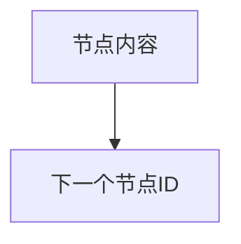
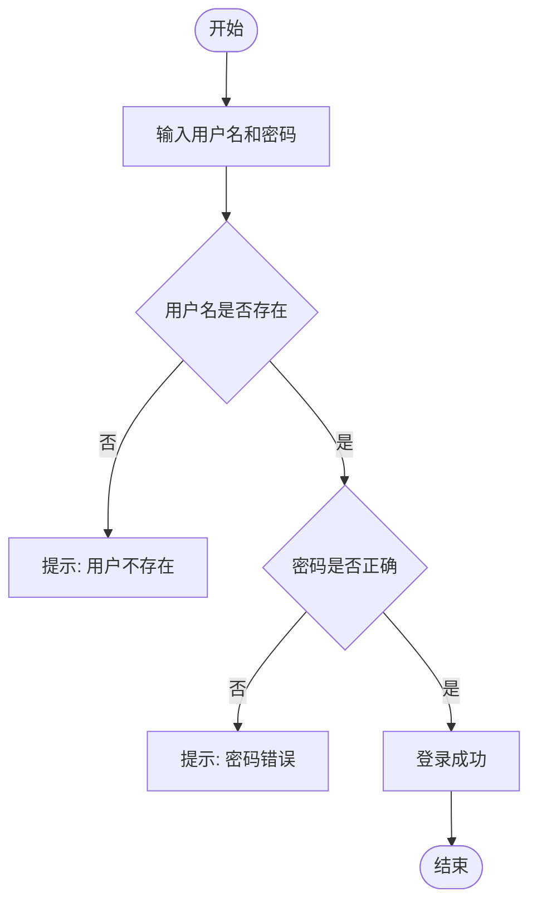

# 使用说明

当用户提到以下关键词时，**必须**加载并执行此技能：
- "生成流程图"
- "转换为流程图"
- "flowchart"
- "梳理为流程图"
- "画流程图"
- "需求流程图"

---

## 执行步骤

### 步骤一：分析需求内容

仔细阅读用户提供的需求内容，识别以下要素：

| 要素 | 说明 |
|------|------|
| 入口/起点 | 流程开始的位置 |
| 判断节点 | 条件分支（如：是/否、已签收/未签收） |
| 操作节点 | 具体的业务操作或用户操作 |
| 接口调用 | 系统间的接口交互 |
| 结束节点 | 流程结束或异常终止 |
| 表单/输入 | 需要用户填写的信息 |

---

### 步骤二：梳理流程分支

根据需求内容，梳理出主要流程和分支流程：

1. **主流程**：正常情况下的业务路径
2. **异常流程**：失败、拒绝、不支持等情况的处理
3. **并行流程**：可同时进行的操作

---

### 步骤三：生成 Mermaid Flowchart 语法

按照以下规范生成流程图：

#### 3.1 基本语法结构



#### 3.2 节点类型

| 类型 | 语法 | 用途 |
|------|------|------|
| 矩形节点 | `A["文本"]` | 普通操作节点（推荐使用双引号） |
| 菱形节点 | `A{"判断条件"}` | 条件判断节点（推荐使用双引号） |
| 圆角矩形 | `A(["文本"])` | 开始/结束节点（推荐使用双引号） |
| 平行四边形 | `A[/"文本"/]` | 输入/输出节点（推荐使用双引号） |

> **重要**：当节点文本包含特殊字符（冒号 `:`、井号 `#`、引号等）时，**必须**用双引号包裹文本，否则会导致解析错误。

#### 3.3 连线样式

| 样式 | 语法 | 用途 |
|------|------|------|
| 实线箭头 | `-->` | 默认连接 |
| 带文字箭头 | `--\|文字\|-->` | 分支说明 |
| 虚线箭头 | `-..->` | 可选路径 |

#### 3.4 多行文本

使用 `<br/>` 换行：
```
A[第一行<br/>第二行]
```

#### 3.5 并行节点

**推荐写法**：使用单独的箭头连接，避免 `&` 语法在某些渲染器中不兼容：
```
A --> B
A --> C
B --> D
C --> D
```

**备选写法**（部分渲染器支持）：使用 `&` 连接并行节点：
```
A --> B
A --> C
B & C --> D
```

#### 3.6 分组子图

使用 `subgraph` 将相关节点分组，使流程图结构更清晰：
```
subgraph S1[分组名称]
    A --> B --> C
end
```

#### 3.7 节点样式

使用 `style` 为节点添加颜色：
```
style A fill:#e1f5fe      %% 蓝色背景
style B fill:#ffebee      %% 红色背景
style C fill:#e8f5e9      %% 绿色背景
style D fill:#fff3e0      %% 橙色背景
style E fill:#f3e5f5      %% 紫色背景
```

常用颜色方案：
- 开始节点：`#e1f5fe`（浅蓝）
- 结束节点：`#e8f5e9`（浅绿）
- 错误/异常节点：`#ffebee`（浅红）
- 警告节点：`#fff3e0`（浅橙）
- 弹窗/表单节点：`#f3e5f5`（浅紫）

---

### 步骤四：语法检查与修复

生成流程图后，**必须**进行语法检查，发现错误立即修复。

#### 4.1 常见语法错误及修复

| 错误类型 | 错误示例 | 正确写法 | 说明 |
|----------|----------|----------|------|
| 特殊字符未引号 | `A([开始: 工具栏])` | `A(["开始: 工具栏"])` | 含冒号、井号等特殊字符时必须用双引号包裹 |
| 中文特殊字符 | `A[提示：成功]` | `A["提示: 成功"]` | 中文冒号改为英文冒号并加引号 |
| 节点ID重复 | 多个 `A[xxx]` | 使用唯一ID如 `A1`、`A2` | 每个节点ID必须唯一 |
| 引号未转义 | `A[提示"错误"]` | `A["提示'错误'"]` | 节点内使用单引号替代双引号 |
| 箭头语法错误 | `A -> B` | `A --> B` | 必须使用双横线 |
| 分支标签错误 | `A -->|是|B` | `A -->\|是\| B` | 分支文字用竖线包裹 |
| 节点内容为空 | `A[]` | `A["操作名称"]` | 节点内容不能为空 |
| 特殊字符未处理 | `A[成功<失败]` | `A["成功/失败"]` | 避免尖括号等特殊字符 |
| 括号不匹配 | `A{判断]` | `A{"判断"}` | 节点括号必须配对 |
| 并行语法兼容性 | `B & C --> D` | `B --> D`<br/>`C --> D` | `&` 语法在某些渲染器不支持 |

#### 4.2 检查清单

生成后逐项检查：

- [ ] 所有节点ID唯一且有意义
- [ ] 所有箭头语法正确（`-->` 或 `-.->`）
- [ ] 节点括号配对正确：`[]`、`{}`、`([])`、`[//]`
- [ ] 分支标签格式正确：`--|文字|-->` 或 `-->|文字|`
- [ ] 无中文特殊字符（冒号、引号、括号等）
- [ ] 多行文本使用 `<br/>` 换行
- [ ] 并行节点使用单独箭头连接（避免 `&` 语法）
- [ ] 无孤立节点（所有节点都有连线）
- [ ] 特殊字符节点使用双引号包裹

#### 4.3 自动修复规则

```
修复前                              修复后
─────────────────────────────────────────────────────
A([开始: 工具栏])                 →  A(["开始: 工具栏"])
A[提示：成功]                    →  A["提示: 成功"]
A[显示"确认"]                    →  A["显示'确认'"]
A --> B -->                      →  A --> B（删除多余箭头）
A{判断]                          →  A{"判断"}
A[操作] -->                      →  A["操作"] --> B（补充目标节点）
B & C --> D                      →  B --> D  C --> D（拆分并行连接）
```

---

### 步骤五：输出格式

直接输出 Mermaid flowchart 代码块，无需额外说明：


---

## 示例

### 输入

```
用户登录流程：
1. 用户输入用户名和密码
2. 系统验证用户名是否存在
   - 不存在：提示"用户不存在"
   - 存在：继续验证密码
3. 验证密码是否正确
   - 错误：提示"密码错误"
   - 正确：登录成功
```

### 输出



---

## 注意事项

1. **节点命名**：使用有意义的节点ID，如 `checkSign`、`callApi` 等
2. **层级清晰**：使用 TD（从上到下）或 LR（从左到右）保持流程清晰
3. **分支完整**：每个判断节点的所有分支都要有处理路径
4. **简洁明了**：节点文字控制在 20 字以内，过长使用换行
5. **接口标注**：涉及接口调用时，可在节点中标注接口名称或负责人
6. **语法校验**：生成后必须检查语法，确保可正常渲染
7. **双引号包裹**：节点文本包含特殊字符（冒号、井号等）时必须用双引号包裹
8. **避免并行语法**：使用单独箭头连接替代 `&` 语法，确保兼容性
9. **善用子图**：复杂流程使用 `subgraph` 分组，使结构更清晰
